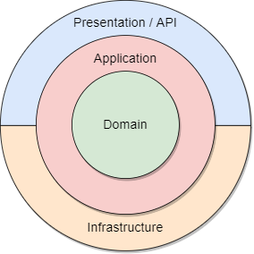

# Masraf Yönetim Sistemi

### Amaç:

- Şirketin sahada çalışan personeli için masraf kalemlerinin anlık takibi ve yönetimi sağlanacaktır.
- **Personel**, masraflarını anında sisteme girebilecek ve geri ödeme talep edebilecektir.
- İşveren, masrafları anlık olarak takip edebilecek, onaylayabilecek ve ödemeleri vakit kaybetmeden yapabilecektir.
- Çalışanlar, evrak ve fiş toplama zahmetinden kurtulacak ve ödemelerini gecikmeden alabilecektir.
- Uygulama, "**Yönetici**" ve "**Personel**" olmak üzere iki farklı kullanıcı rolüne sahip olacaktır:
  - **Personel:**
    - Sisteme masraf girişi yapabilecek ve geri ödeme talep edebilecektir.
    - Mevcut taleplerini ve durumlarını (onayda bekleyen, onaylanan, reddedilen) takip edebilecektir.
  - **Yönetici:**
    - Mevcut masraf taleplerini görebilecek, onaylayabilecek veya reddedebilecektir.
    - Onaylanan ödemeler, banka entegrasyonu ile anında çalışanın hesabına **EFT** olarak aktarılacaktır.
    - Reddedilen talepler için bir açıklama girilebilecek ve bu açıklama talep sahibi personel tarafından görülebilecektir.

### Tech Stack

- DependencyInjection
- .NET 8
- FluentValidation
- [Mapster](https://github.com/MapsterMapper/Mapster?tab=readme-ov-file#why-mapster)
- [.NET Channels](#channels) (**EFT**)
- Dapper (**SQL Views**)
- [EntityFramework Core 8](#entityframework-core-8) ([Audit](#entity-audits) & [SoftDelete](#soft-delete) & [Interceptors](#efcore-interceptors))
- Jwt (Authentication & Authorization)
- [ASP.NET Core Identity](https://learn.microsoft.com/en-us/aspnet/core/security/authentication/identity?view=aspnetcore-9.0)
- MSSQL
- SQL MANAGEMENT
- Swagger
- [Postman](https://documenter.getpostman.com/view/44216110/2sB2j7d9ew)

### Kullanılan Patternler

- [Decator Pattern](#decator-pattern)
- Repository
- [Entity Base](#entity-base)
- [Unit Of Work](#unit-of-work-pattern)

### Mimari

**Onion Architecture**



#### Decator Pattern

Gerekli validasyonların sağlanması amacıyla, FluentValidation kütüphanesi kullanılarak DTO (Data Transfer Object) verileri için bir Decorator Pattern implementasyonu tercih edilmiştir. Bu yaklaşım, validasyon mantığını ana iş logiğinden ayırarak daha modüler ve yönetilebilir bir yapı sunar.

Dependency Injection (DI) konteynerine servis kaydı yapılırken, validasyonları içeren decorator sınıfı, asıl servisi sarmalayacak şekilde yapılandırılmıştır.

Örnek bir servis kaydı;

```csharp
 services.AddScoped<IExpenseCategoryService, ExpenseCategoryValidationManagerDecator>(sp => {
     var expenseCategoryService = sp.GetRequiredService<ExpenseCategoryManager>();
     var createExpenseCategoryValidator = sp.GetRequiredService<IValidator<CreateExpenseCategoryDto>>();
     var updateExpenseCategoryValidator = sp.GetRequiredService<IValidator<UpdateExpenseCategoryDto>>();
     return new ExpenseCategoryValidationManagerDecator(expenseCategoryService, createExpenseCategoryValidator, updateExpenseCategoryValidator);
 });
```

#### Unit of Work Pattern

EFCore'un kendi bünyesinde bir soyutlama katmanı barındırmasına rağmen, uygulama katmanına veritabanı detaylarının sızmasını engellemek ve özellikle transaction bütünlüğünü sağlamak amacıyla Repository ve Unit of Work desenleri tercih edilmiştir. Unit of Work'ün servis kaydı aşağıdaki gibi gerçekleştirilmiştir:

```csharp

services.AddDbContext<ApplicationDbContext>(options => {
    options.UseSqlServer(configuration.GetConnectionString("DefaultConnection"));
});

services.AddScoped<IUnitOfWork>(sp => sp.GetRequiredService<ApplicationDbContext>());
```

### Entity Audits

Bir varlığın ne zaman oluşturulduğu ve ne zaman güncellendiği bilgisini yönetmemizi sağlayan bir arayüzdür. Bu bilgiler otomatik olarak [**EFCore Interceptor**](#efcore-interceptors) kullanarak `SaveChanges` işlemi sırasında atanır. Silinmiş varlıkların sorgularda görünmesini engellemek için entity'lere `QueryFilter` eklenmiştir. Bu `HasQueryFilter`, EFCore query'i build ettiği zaman otomatik olarak `Where` koşulu olarak eklenir. İhtiyaç halinde bu filtreyi belirli sorgularda devre dışı bırakmak da mümkündür ([daha fazla bilgi](https://learn.microsoft.com/en-us/ef/core/querying/filters#disabling-filters)).

```csharp
public interface IAuditableEntity {
    DateTime CreatedAtUtc { get; set; }
    DateTime? UpdatedAtUtc { get; set; }
}
```

### Soft Delete

```csharp
public interface ISoftDeletable {
    DateTime? DeletedAtUtc { get; set; }
}
```

### Entity Base

```csharp
public class EntityBase : EntityBase<int> { }

public class EntityBase<T> : IAuditableEntity, ISoftDeletable {
    public T Id { get; set; }
    public DateTime CreatedAtUtc { get; set; }
    public DateTime? UpdatedAtUtc { get; set; }
    public DateTime? DeletedAtUtc { get; set; }
}
```

### EntityFramework Core 8

EFCore ile Code First yaklaşımı benimsenmiş olup, veritabanı migration'larının yönetimi EFCore'a bırakılmıştır. Varlıklar arası ilişkiler, EFCore'un navigation property'leri ile kurulmuş; ihtiyaç duyulan detaylı yapılandırmalar için ise `IEntityTypeConfiguration` arayüzü kullanılmıştır.

Ayrıca, migration'lar aracılığıyla varsayılan kullanıcı ve roller gibi başlangıç verilerinin (seed data) eklenmesi için EFCore'un veri tohumlama (data seeding) özelliği tercih edilmiştir.

```csharp
public class UserConfiguration : IEntityTypeConfiguration<ApplicationUser> { }
```

Bu filtre, tüm `IQueryable` sorgularına otomatik olarak eklenir. ([bkz.](https://learn.microsoft.com/en-us/ef/core/querying/filters#example))

```csharp
// ExpenseManagementSystem.Persistence.Context
protected override void OnModelCreating(ModelBuilder modelBuilder) {
  modelBuilder.Entity<T>() // T -> ISoftDeletable
         .HasQueryFilter(entity => entity.DeletedAtUtc == null);
}
```

### EFCore Interceptors

- **IAuditableEntityInterceptor**: `IAuditableEntity` arayüzünü implemente eden varlıklar için oluşturma (`CreatedAtUtc`) ve güncelleme (`UpdatedAtUtc`) zaman damgalarını otomatik olarak yönetir. Bu interceptor, `SaveChangesAsync` çağrıldığında, eklenen veya güncellenen varlıkları tespit eder ve ilgili zaman damgası alanlarını ayarlar.
- **ISoftDeletableEntityInterceptor**: `ISoftDeletable` arayüzünü implemente eden varlıklar için "soft delete" (geçici silme) işlemini yönetir. Bir varlık silindiğinde, veritabanından fiziksel olarak kaldırılmaz; bunun yerine `DeletedAtUtc` alanı işaretlenir ve `EntityState` durumu `Modified` olarak değiştirilir. Bu sayede, silinen verilere daha sonra erişilebilir veya geri yüklenebilir.

Interceptor'ların Dependency Injection (DI) konteynerine kaydı ve DbContext'e entegrasyonu aşağıdaki gibi yapılır:

```csharp
services.AddSingleton<AuditableEntityInterceptor>();
services.AddSingleton<SoftDeletableEntityInterceptor>();

services.AddDbContext<ApplicationDbContext>((sp, options) => {
    options.AddInterceptors(
        sp.GetRequiredService<AuditableEntityInterceptor>(),
        sp.GetRequiredService<SoftDeletableEntityInterceptor>());
});
```

```csharp
public class AuditableEntityInterceptor : SaveChangesInterceptor {
    public override ValueTask<InterceptionResult<Int32>> SavingChangesAsync(
        DbContextEventData eventData,
        InterceptionResult<Int32> result,
        CancellationToken cancellationToken = default) {
        var context = eventData.Context;
        if(context == null) {
            throw new ArgumentNullException(nameof(context));
        }

        var entries = context.ChangeTracker.Entries()
            .Where(e => e.Entity is IAuditableEntity
            && (e.State == EntityState.Added || e.State == EntityState.Modified));

        foreach(var entry in entries) {
            var entity = (IAuditableEntity)entry.Entity;
            if(entry.State == EntityState.Added) {
                entity.CreatedAtUtc = DateTime.UtcNow;
            }
            else {
                entity.UpdatedAtUtc = DateTime.UtcNow;
            }
        }
        return base.SavingChangesAsync(eventData, result, cancellationToken);
    }
}
```

```csharp
public class SoftDeletableEntityInterceptor : SaveChangesInterceptor {
    public override ValueTask<InterceptionResult<Int32>> SavingChangesAsync(
        DbContextEventData eventData,
        InterceptionResult<Int32> result,
        CancellationToken cancellationToken = default) {
        var context = eventData.Context;
        if(context == null) {
            throw new ArgumentNullException(nameof(context));
        }
        var entries = context.ChangeTracker.Entries()
            .Where(e => e.Entity is ISoftDeletable && e.State == EntityState.Deleted);
        foreach(var entry in entries) {
            entry.State = EntityState.Modified;
            ((ISoftDeletable)entry.Entity).DeletedAtUtc = DateTime.UtcNow;
        }
        return base.SavingChangesAsync(eventData, result, cancellationToken);
    }
}
```

### Channels

**EFT** işlemleri için, harici bir mesaj kuyruğu sistemi (örn: RabbitMQ, Kafka) yerine .NET içerisinde yerleşik olarak bulunan `System.Threading.Channels` mekanizması tercih edilmiştir. Bu yaklaşım, uygulamanın karmaşıklığını artırmadan, asenkron ve sıralı bir şekilde EFT taleplerini işlemek için hafif ve etkili bir çözüm sunar.

[Microsoft .NET Channels Dökümanı](https://learn.microsoft.com/en-us/dotnet/core/extensions/channels)

Temelde, bir "in-memory" mesajlaşma sistemi gibi çalışır. EFT talepleri bir `ChannelWriter` aracılığıyla kanala yazılır ve bir `BackgroundService` içerisinde çalışan `ChannelReader` tarafından okunarak işlenir. Bu sayede, EFT işlemleri ana uygulama akışını bloke etmeden arka planda gerçekleştirilir.

Bu projede, `IEftChannel` arayüzü ve `EftChannel` implementasyonu ile bir kanal oluşturulmuştur. `EftBackgroundService` ise bu kanalı dinleyerek gelen EFT taleplerini işler, bir gecikme simülasyonu yapar ve ardından veritabanına ödeme kaydını ekler.

Bu yapı, gelecekte ihtiyaç duyulması halinde, sistemi daha kapsamlı bir mesajlaşma altyapısına (örn: RabbitMQ, [Redis Pub/Sub](https://redis.io/glossary/pub-sub/)) taşımak için de uygun bir temel oluşturur. `EftBackgroundService` ayrı bir worker servisine dönüştürülerek ölçeklenebilirlik sağlanabilir.

```csharp
public interface IEftChannel
{
    ChannelWriter<EftRequestDto> Writer { get; }
    ChannelReader<EftRequestDto> Reader { get; }
}

public class EftChannel : IEftChannel  {
    private readonly Channel<EftRequestDto> _channel;
    public EftChannel() {
        _channel = Channel.CreateUnbounded<EftRequestDto>();
    }

    public ChannelWriter<EftRequestDto> Writer => _channel.Writer;
    public ChannelReader<EftRequestDto> Reader => _channel.Reader;
}
```

```csharp
// ExpenseManagementSystem.Infrastructure.BackgroundServices;
protected override async Task ExecuteAsync(CancellationToken stoppingToken)
{
    await foreach (var req in _eftChannel.Reader.ReadAllAsync(stoppingToken))
    {
        try
        {
            _logger.LogInformation($"[EFT] Simulating {req.Amount}₺: {req.FromIban} → {req.ToIban}");
            await Task.Delay(2000, stoppingToken);

            using var scope = _scopeFactory.CreateScope();
            var db = scope.ServiceProvider
                          .GetRequiredService<ApplicationDbContext>();
            var payment = new Payment
            {
                ExpenseRequestId = req.ExpenseRequestId,
                Amount = req.Amount,
                PaidAt = DateTime.UtcNow,
                Status = "Paid",
                SenderUserId = null!,
                ReceiverUserId = db.ExpenseRequests.Find(req.ExpenseRequestId)!.UserId
            };
            db.Payments.Add(payment);

            await db.SaveChangesAsync(stoppingToken);

            _logger.LogInformation($"[EFT] Completed for Request {req.ExpenseRequestId}");
        }
        catch (Exception ex)
        {
            _logger.LogError(ex, $"[EFT] Error processing request {req.ExpenseRequestId}");
        }
    }
}
```

### Proje Kurulumu

Projeyi yerel makinenizde çalıştırmak için aşağıdaki adımları izleyebilirsiniz:

1.  **Ön Gereksinimler:**

    - [.NET 8 SDK](https://dotnet.microsoft.com/download/dotnet/8.0) veya üzeri
    - [SQL Server](https://www.microsoft.com/tr-tr/sql-server/sql-server-downloads) (Express, Developer veya üzeri sürüm)
    - [SQL Server Management Studio (SSMS)](https://learn.microsoft.com/en-us/sql/ssms/download-sql-server-management-studio-ssms) (Opsiyonel, veritabanı yönetimi için)
    - [Git](https://git-scm.com/downloads)

2.  **Veritabanı Yapılandırması ve Kurulumu:**
    - `ExpenseManagementSystem.WebAPI/appsettings.json` (ve `appsettings.Development.json`) dosyasındaki `ConnectionStrings:DefaultConnection` bölümünü kendi SQL Server örneğinize göre güncelleyin.
    - Visual Studio içerisinde, Package Manager Console (PMC) açın.
    - Varsayılan proje olarak `ExpenseManagementSystem.Persistence` seçili olduğundan emin olun.
    - Aşağıdaki komutu çalıştırarak migration'ları uygulayın ve veritabanını oluşturun/güncelleyin:
    ```powershell
    Update-Database
    ```
    Bu komut, veritabanı şemasını oluşturacak ve `SeedData` ile tanımlanmış başlangıç verilerini (`Administrator`, `Personnel` rolleri ve kullanıcılarını) ekleyecektir.

### API Endpointleri

Uygulamanın sunduğu API endpoint'lerinin detaylı dokümantasyonuna, örnek istek ve yanıtlarına aşağıdaki Postman koleksiyonu üzerinden erişebilirsiniz:

- [Postman API Dokümantasyonu ve Test Koleksiyonu](https://documenter.getpostman.com/view/44216110/2sB2j7cosK)

### Veritabanı Tasarımı

Projede **Code First** yaklaşımı benimsenmiş olup, veritabanı şeması Entity Framework Core 8 aracılığıyla yönetilmektedir. `ApplicationUser` ve `ApplicationRole` gibi ASP.NET Core Identity varlıkları dışında, projeye özgü çoğu temel varlık (örneğin, `ExpenseRequest`, `Expense`, `ExpenseCategory`, `ExpenseDocument`, `Payment`) `EntityBase` sınıfından türer. Bu ortak `EntityBase` sınıfı, varlıklara `Id (int)` primary key alanını ve `IAuditableEntity` (`CreatedAtUtc`, `UpdatedAtUtc`) ile `ISoftDeletable` (`DeletedAtUtc`) arayüzlerinden gelen denetim ve geçici silme alanlarını otomatik olarak ekler. Bu standart alanlara ek olarak, temel varlıklar ve aralarındaki ilişkiler aşağıdaki gibidir:

- **`ApplicationUser` (AspNetUsers)**: Sistem kullanıcılarını (Personel, Yönetici) temsil eder. ASP.NET Core Identity'den miras alır.
- **`ApplicationRole` (AspNetRoles)**: Kullanıcı rollerini (`Administrator`, `Personnel` vb.) tanımlar. ASP.NET Core Identity'den miras alır.
- **`ExpenseRequest`**: Kullanıcıların masraf geri ödeme taleplerini temsil eder.
  - `UserId` (masraf talebinde bulunan `ApplicationUser`'a referans), `User` (navigasyon özelliği).
  - `Status` (`ApprovalStatus` enum: Onay Bekliyor, Onaylandı, Reddedildi), `RejectionReason` (reddedilme nedeni), `RequestDate` (talep tarihi).
  - İlişkili Koleksiyonlar:
    - `Expenses`: Bu talebe ait masraf kalemlerini içerir (bir `ExpenseRequest` birden çok `Expense` içerebilir).
    - `Payments`: Bu talep için yapılan ödemeleri içerir (bir `ExpenseRequest` birden çok `Payment` içerebilir).
    - `Documents`: Bu talebe eklenmiş belgeleri içerir (bir `ExpenseRequest` birden çok `ExpenseDocument` içerebilir).
- **`Expense`**: Bir masraf talebi içerisindeki tek bir masraf kalemini ifade eder.
  - `ExpenseCategoryId` (`ExpenseCategory`'ye referans, masrafın türü), `ExpenseCategory` (navigasyon özelliği).
  - `ExpenseRequestId` (`ExpenseRequest`'e referans, ait olduğu masraf talebi), `ExpenseRequest` (navigasyon özelliği).
  - Temel Alanlar: `Amount` (tutar), `Description` (açıklama).
- **`ExpenseCategory`**: Masraf kalemlerinin sınıflandırıldığı kategorileri (örn: Yemek, Ulaşım, Konaklama) tanımlar.
  - Temel Alanlar: `Name` (kategori adı), `IsActive` (kategorinin aktif olup olmadığı).
  - İlişkili Koleksiyonlar: `Expenses` (bu kategoriye ait masraf kalemleri).
- **`ExpenseDocument`**: Bir masraf talebiyle ilişkili yüklenmiş belgeleri (fiş, fatura vb.) temsil eder.
  - `ExpenseRequestId` (`ExpenseRequest`'e referans), `ExpenseRequest` (navigasyon özelliği).
  - Temel Alanlar: `FileId` (dosya kimliği), `FileName` (dosya adı), `Location` (dosyanın konumu/yolu).
- **`Payment`**: Onaylanmış bir masraf talebi için yapılan ödeme kaydını tutar.
  - `ExpenseRequestId` (`ExpenseRequest`'e referans), `ExpenseRequest` (navigasyon özelliği).
  - `SenderUserId` (ödemeyi yapan `ApplicationUser`'a referans), `SenderUser` (navigasyon özelliği).
  * `ReceiverUserId` (ödemeyi alan `ApplicationUser`'a referans), `ReceiverUser` (navigasyon özelliği).
  - Temel Alanlar: `Amount` (ödenen tutar), `PaidAt` (ödeme tarihi), `Status` (ödeme durumu).

Varlıklar arası ilişkiler (genellikle one-to-many) EFCore'un navigation property'leri ve gerektiğinde Fluent API (`IEntityTypeConfiguration<T>`) kullanılarak yapılandırılmıştır. Veritabanı migration'ları, şema değişikliklerini ve başlangıç verilerini (seed data) yönetmek için kullanılır. `ExpenseCategory` gibi `EntityBase`'den türeyen varlıklar, `IAuditableEntity` ve `ISoftDeletable` arayüzleri aracılığıyla standart denetim (oluşturma/güncelleme zaman damgaları) ve geçici silme (soft delete) alanlarına sahip olur. Diğer varlıklar için bu özellikler, projeye özgü implementasyonlarla veya `EntityBase` benzeri yapılarla sağlanabilir.

### Kaynakçalar ve Referanslar

Bu projenin geliştirilmesi sırasında yararlanılan veya projede kullanılan temel teknolojiler, kütüphaneler ve araçlar aşağıda listelenmiştir:

- **.NET 8**: [Microsoft .NET Resmi Sitesi](https://dotnet.microsoft.com/tr-tr/download/dotnet/8.0)
- **ASP.NET Core Identity**: [Microsoft Learn - ASP.NET Core Identity](https://learn.microsoft.com/en-us/aspnet/core/security/authentication/identity?view=aspnetcore-8.0)
- **Entity Framework Core 8**: [Microsoft Learn - EF Core](https://learn.microsoft.com/en-us/ef/core/)
- **Mapster**: [GitHub - MapsterMapper/Mapster](https://github.com/MapsterMapper/Mapster)
- **FluentValidation**: [FluentValidation Kütüphanesi](https://fluentvalidation.net/)
- **Dapper**: [GitHub - DapperLib/Dapper](https://github.com/DapperLib/Dapper)
- **.NET Channels (System.Threading.Channels)**: [Microsoft .NET Blog - An Introduction to System.Threading.Channels](https://devblogs.microsoft.com/dotnet/an-introduction-to-system-threading-channels/) | [Microsoft Learn - Channels](https://learn.microsoft.com/en-us/dotnet/core/extensions/channels)
- **JWT (JSON Web Tokens)**: [JWT.io](https://jwt.io/)
- **Swagger (OpenAPI / Swashbuckle)**: [Swashbuckle.AspNetCore GitHub](https://github.com/domaindrivendev/Swashbuckle.AspNetCore)
- **Postman**: [Postman API Platformu](https://www.postman.com/)
  - Proje API Dokümantasyonu: [Expense Management System API Docs](https://documenter.getpostman.com/view/44216110/2sB2j7cosK)
- **SQL Server**: [Microsoft SQL Server İndirmeleri](https://www.microsoft.com/tr-tr/sql-server/sql-server-downloads)
- **Onion Architecture**: [Jeffrey Palermo - The Onion Architecture](https://jeffreypalermo.com/2008/07/the-onion-architecture-part-1/)
- **Repository Pattern**: [Microsoft Learn - Repository Pattern](https://learn.microsoft.com/en-us/dotnet/architecture/microservices/microservice-ddd-cqrs-patterns/infrastructure-persistence-layer-implementation-entity-framework-core)
- **Unit of Work Pattern**: [Microsoft Learn - Unit of Work Pattern](https://learn.microsoft.com/en-us/aspnet/mvc/overview/older-versions/getting-started-with-ef-5-using-mvc-4/implementing-the-repository-and-unit-of-work-patterns-in-an-asp-net-mvc-application)
- **Decorator Pattern**: [Refactoring Guru - Decorator Pattern](https://refactoring.guru/design-patterns/decorator)
- **Redis Pub/Sub** (Gelecekteki potansiyel kullanım için referans): [Redis Pub/Sub](https://redis.io/glossary/pub-sub/)
